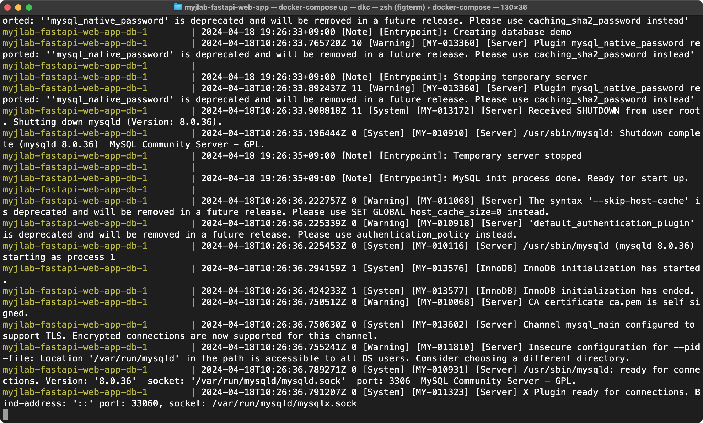

# Docker, FastAPI, MySQLを用いたTODOアプリのサンプル
## 前提条件
Dockerのインストールを完了させておくこと

- [Windows10の場合](docs/install-docker-windows10.md)
- Windows11の場合(WIP)
- [Macの場合](docs/install-docker-mac.md)


## 起動方法
1. 以下のコマンドを実行してprjのディレクトリに移動します。
```bash 
cd
cd Desktop
cd myj-fastapi-web-app
```

2. 以下のコマンドを実行してprjを起動します。
```bash
docker-compose up
```
※ ⚠️ ※ **注意** 初回はかなり時間がかかるので，下記のログが出力されるまではしばらく待機


3. **(初回のみ)** 以下のコマンドを実行してDBのテーブルを作成します。

- macの場合
```bash
sh script/migrate_db.sh
```
   - windowsの場合
```bash
script\migrate_db.bat
```

### アクセス方法
すると、以下のURLでアクセスできます。
- API: http://localhost:8000/docs
- フロントエンド: http://localhost:3000

### DBの内部を直接確認したい、操作したい
こちらのドキュメント[how-to-use-vscode-mysql-plugin.md](docs/how-to-use-vscode-mysql-plugin.md)を参照してください。

### 停止

docker-compose up コマンドを実行したウィンドウで `Ctrl + c`。

## 開発の進め方
### api
基本的には`api`ディレクトリのファイルを編集して開発を進めていきます。
- `api`ディレクトリの構成は以下の通りです。
  - `api`
    - `models/*`: DBのテーブル構造を定義するファイルを置きます。
    - `routers/*`: APIのエンドポイントを定義するファイルを置きます。
    - `schemas/*`: APIのリクエストとレスポンスの受け渡しデータの構造を定義するファイルを置きます。
    - `cruds/*`: DBの操作を行うファイルを置きます。
    - `db.py`: DBの接続情報を定義するファイルを置きます。

### DBのテーブル構造の変更について
- DBテーブルの定義はすべて`api/models`の**直下**に置く必要があります。(そうじゃないと読み込まれません)
- DBテーブルの構造を変更した場合、実際のDBに反映するためには以下のコマンドを実行する必要があります。
  - macの場合
  - `sh script/migrate_db.sh`
  - windowsの場合
  - `script\migrate_db.bat`
- このコマンドは、DBのすべてのデータを削除します今DBに存在するデータを`api/db_back_up/`にバックアップされます。

### frontend
基本的には`frontend`ディレクトリのファイルを編集して開発を進めていきます。
- `frontend`ディレクトリの構成は以下の通りです。
  - `frontend`
      - `css/*`: CSSファイルを置きます。
      - `js/*`: JavaScriptファイルを置きます。
        - `api.js`: APIを呼び出す関数を定義するファイルを置きます。
      - `*****.html`: ページごとのHTMLファイルを置きます。


## よく使うコマンドについて
コピペって使ってください。

### プロジェクトの起動
1. `cd`
2. `cd Desktop`
3. `cd myj-fastapi-web-app`
4. `docker-compose up`

### テーブル構造の変更をDBに反映
macの場合: `sh script/migrate_db.sh`

windowsの場合: `script\migrate_db.bat`

### 新しいパッケージの追加
macの場合: `sh script/add-package.sh <パッケージ名>`

windowsの場合: `script\add-package.bat <パッケージ名>`

## FQA
## Q: Windowsにおいて、`cd Desktop`でエラーが出る

Windowsの場合、OneDriveの関係でDesktopが存在しない場合があります。

その場合、`cd OneDrive`で移動して`dir`でディレクトリの一覧を確認しながら、`Desktop`か`デスクトップ`に移動してください。

## Q: フロントエンドでAPIを呼び出すと422エラーが出る
422は、リクエストの形式が正しくない場合に出るエラーです。以下の点を確認してください。

- API側で定義とた通りのリクエストを送っているか。
  - `http://localhost:8000/docs` でAPIの仕様を確認できます。

- `fetch`の第2引数に`{ body: JSON.stringify(data) }`を指定している場合、`headers: { 'Content-Type': 'application/json' }` の指定が必要です。

## Q: APIの呼び出しは`pymysql.err.ProgrammingError: (1146, "xxxx doesn't exist")`というエラーが出る
`models/`に定義した内容がDBに反映されていない可能性があります。マイグレーションスクリプトを実行してみてください。

macの場合: `sh script/migrate_db.sh`

windowsの場合: `script\migrate_db.bat`

## 備考
prj全体の構造は[`docs/prj-overview.md`](docs/prj-overview.md)を参照してください。

TASAとこのでもアプリ自体を開発する人は必ず読んでください。
