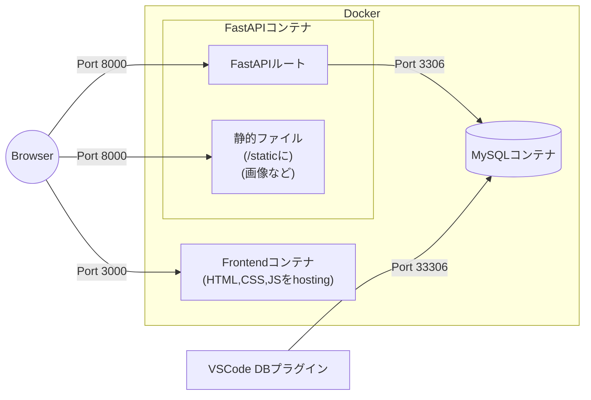
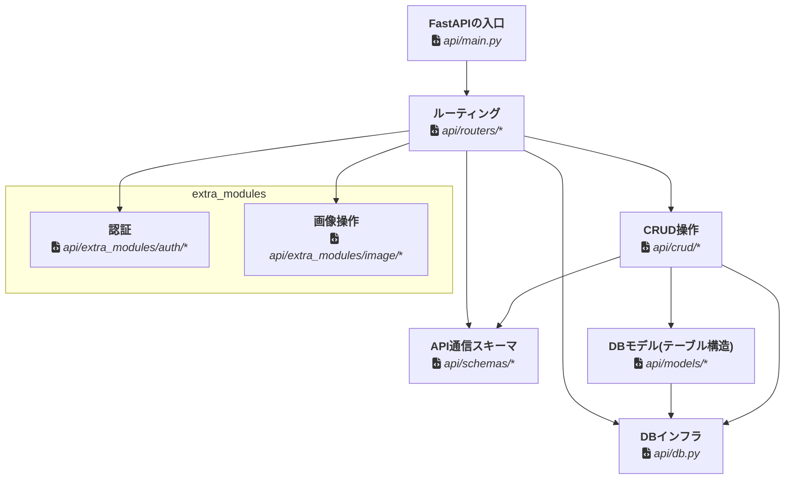
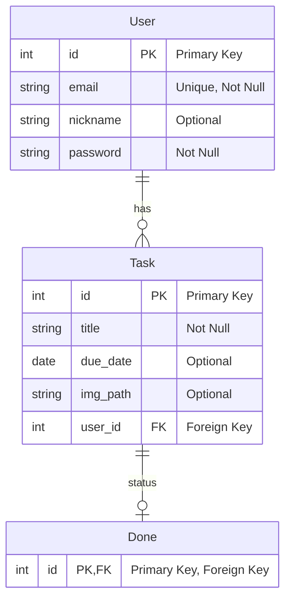

# インフラ構成

# アプリケーション構成
## api
### モジュール依存関係

### モジュール
- **FastAPIの入口**, `api/main.py`
  - FastAPIのインスタンスを作成し、ルーティングを読み込む
  - /staticに静的ファイルのホスティング
  - CORSのミドルウェア
- **ルーティング**, `api/routers/**`
  - ルーティングの定義
  - HTTPからデータを受け取り、CRUD操作に委譲
  - CRUD操作の結果を返す、適切なHTTPエラーを返す
- **API通信スキーマ**, `api/schemas/**`
  - ルーティングで受け取るデータの形を定義
  - ルーティングで返すデータのスキーマ
- **CRUD操作**, `api/crud/**`
  - クエリでDBデータを返す
  - ルーティングで受け取ったデータでDBを操作
    - 基本的に`schemas`を`models`に変換し、`db`に反映
- **DBモデル(テーブル構造)**, `api/models/**`
  - DBのテーブル構造を定義
- **DBインフラ**, `api/db.py`
  - DBの接続情報を定義
  - DBのセッションを管理
- **extra_modules**
  - **基本的に学生は気にしなくていい、使用するだけ**
  - **認証**, `api/extra_modules/auth/**`
    - ユーザー認証に関する処理
  - **画像操作**, `api/extra_modules/image/**`
    - 画像のアップロードを受け保存する

### DB構造

### API構造
(WIP)

## frontend
(WIP)

# スクリプト
(WIP)

# テストについて
(WIP)