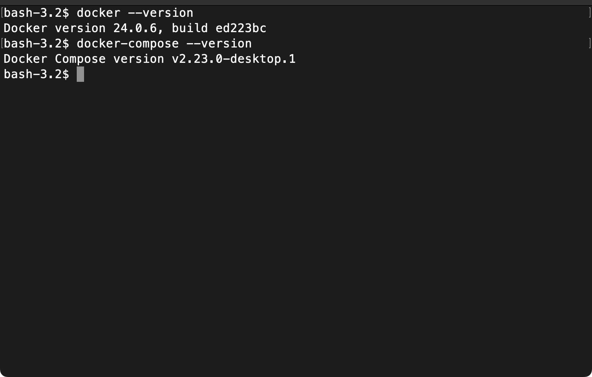
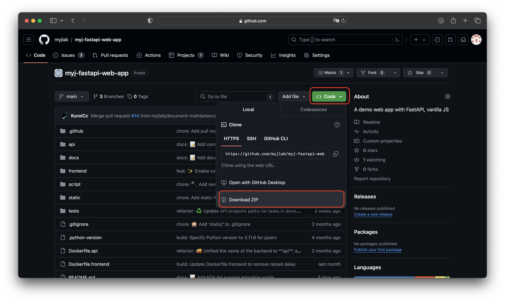

# Macでの環境構築

## CPUの確認

「このMacについて」を開き，CPUを確認する．下記のどちらに当てはまるかを確認して進む

- Intelの場合は下記の画像  
  
- Apple シリコンの場合は下記のリンク  
  [Apple シリコン搭載の Mac コンピュータ](https://support.apple.com/ja-jp/HT211814) 


## Dockerのダウンロード

1. [Docker Desktop](https://www.docker.com/products/docker-desktop)にアクセス
2. Intelの場合はMac with Intel Chip、Apple シリコンの場合はMac with Apple Chipをクリック
  
3. ダウンロードされたファイルをクリックして起動
4. Applicationsフォルダに移動
  - ドラッグ&ドロップで移動する．完了したらウィンドウは閉じて良い
  
4. 起動

- Dockerを起動
  - アプリケーション → Dockerを起動
  - 「⌘ + スペース」で「Docker」と検索して起動

## インストールの確認

### 1. ターミナルを起動
- アプリケーション → その他 → ターミナルを起動
- 「⌘ + スペース」で「terminal」と検索して起動
など

### 2. コマンドで確認
```bash
docker --version
docker-compose --version
```

出力例



## 必要なファイルを準備

1. 以下のリンクから環境構築に使うファイルをダウンロードする
    * https://github.com/myjlab/myj-fastapi-web-app
    * 右の方にある緑色の Clone or download ボタンから Download ZIP を選択
   
2. zip ファイルを*デスクトップ*に移動
3. zipファイルを展開する

---
ここまでできたら[READMEの起動方法へ](../README.md)
--


