# Windows11での環境構築

## 参考ページ
なにかあればこちらの記事と照らし合わせるとよい

[Windows 11にDocker Desktopを入れる手順（令和5年最新版）](https://qiita.com/zembutsu/items/a98f6f25ef47c04893b3)

## Dockerのダウンロード

1. [Docker Desktop](https://www.docker.com/products/docker-desktop)にアクセス

2. Download for Windowsをクリック

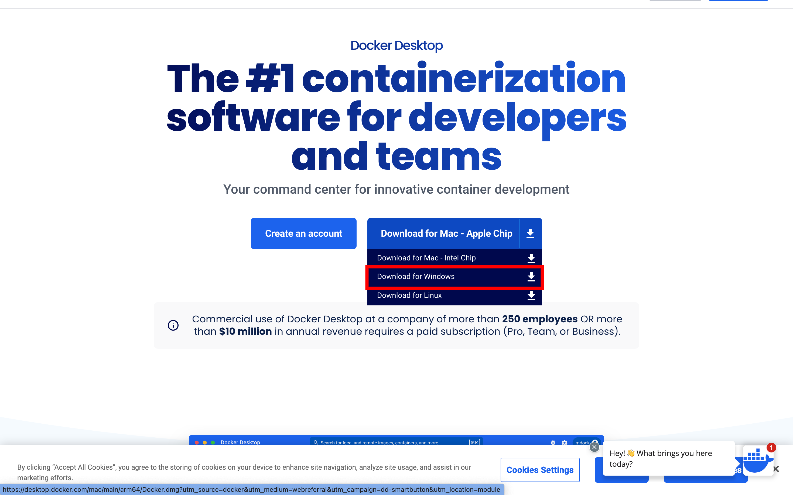

3. ダウンロードされたファイルをクリックして起動

4. インストールの開始，設定などには手を加えず，次に進んでいく

<!-- - もし下記の画面になったら[Windows Updateが必要な場合](#Windows-Updateが必要な場合)に進む

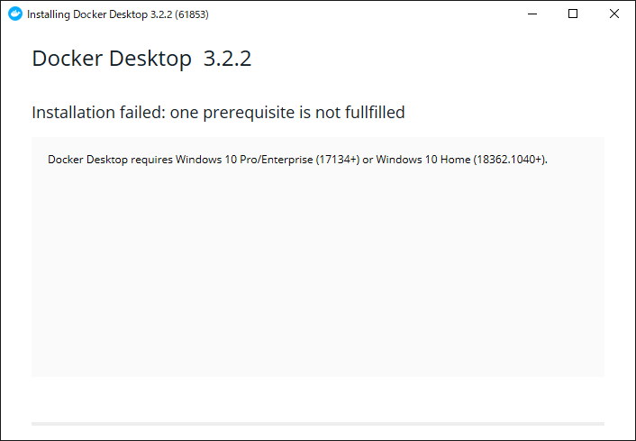 -->

5. インストール完了

- もし下記の画面が出たら[WSL2の更新が必要な場合](#WSL2の更新が必要な場合)に進む

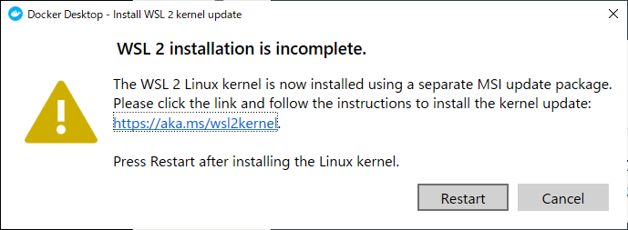

6. Docker Desktopの起動

- 下記に似た画面が出たらインストール及び起動が完了
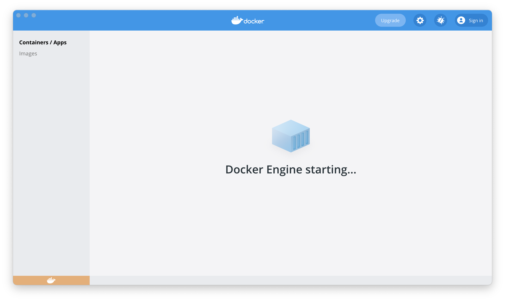

## インストールの確認

### 1. コマンドプロンプトを起動
- 「Windowsキー」を押して「cmd」と入力して「Enter」を押して起動
- 「Windowsキー」を押して「コマンドプロンプト」を検索して起動

など

### 2. コマンドで確認

```bash
docker --version
docker-compose --version
```

出力例
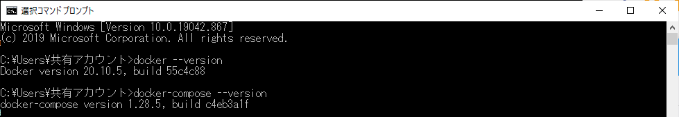

## 必要なファイルを準備

1. 以下のリンクから環境構築に使うファイルをダウンロードする
    * https://github.com/myjlab/myj-fastapi-web-app
    * 右の方にある緑色の Clone or download ボタンから Download ZIP を選択
   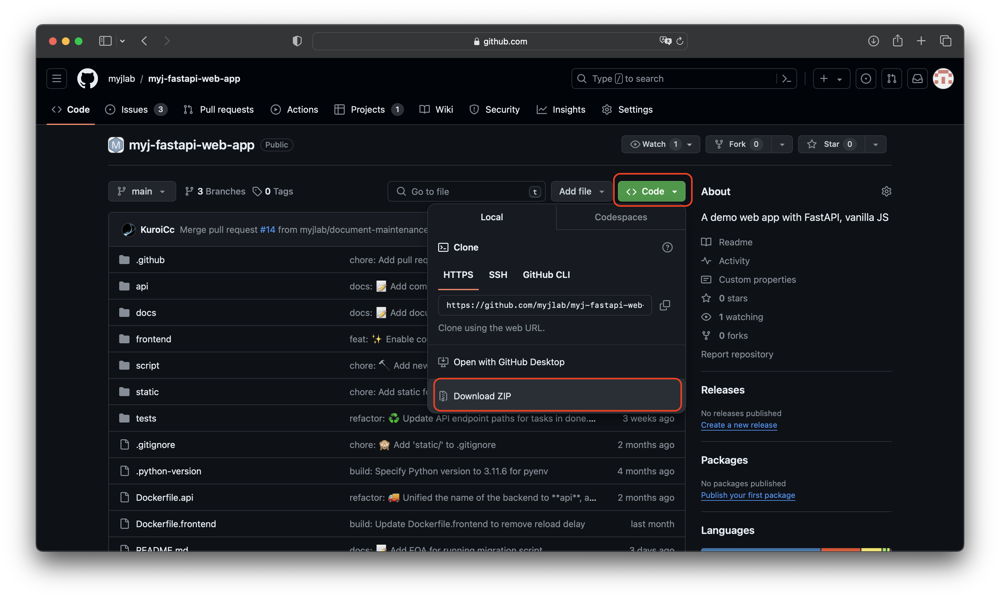
2. zip ファイルを*デスクトップ*に移動
3. zipファイルを展開する

---
ここまでできたら[READMEの起動方法へ](../README.md#起動方法)
--

<br/><br/><br/><br/><br/><br/>

<!-- ## Windows Updateが必要な場合

1. [Windowsダウンロードのページ](https://www.microsoft.com/ja-jp/software-download/windows10IS://www.microsoft.com/ja-jp/software-download/windows10)に進み，下記のボタンからダウンロードする


1. [元の手順](#Dockerのダウンロード)に戻る -->

## WSL2の更新が必要な場合

1. 下記の画面の *「restart」ではなく* リンクをクリック

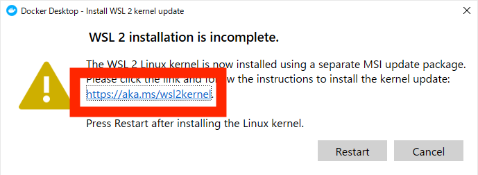

1. 開かれたページの下記のリンクをクリック

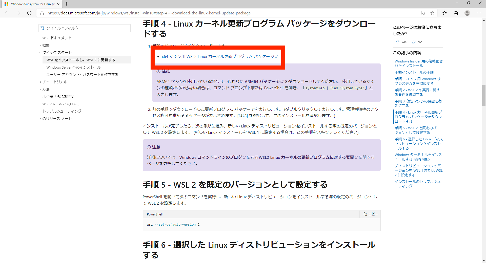

1. ダウンロードされたファイルを開いて，下記の画面が出たら特に変更なく進めていく

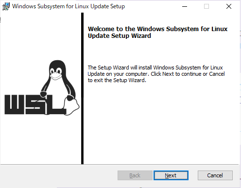

1. 下記の画面まで進めれば完了

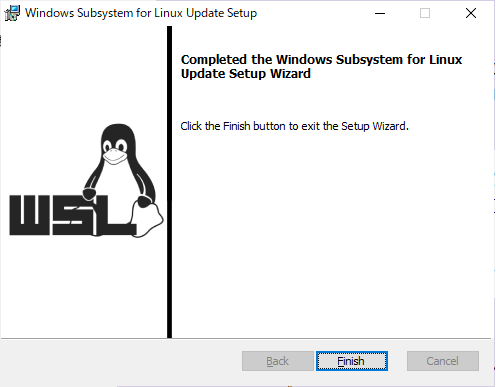

1. 初めの画面の「restart」をクリックして再起動

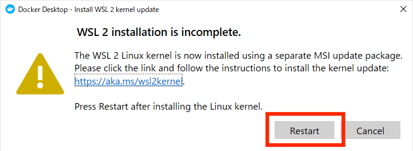
