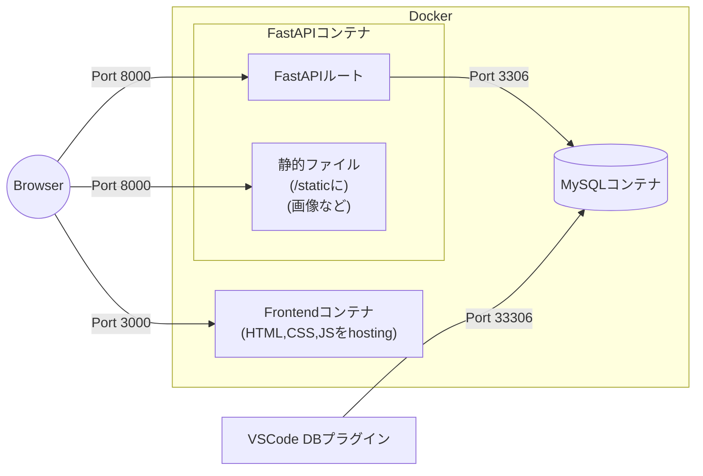
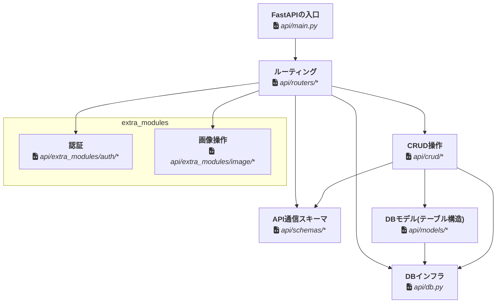
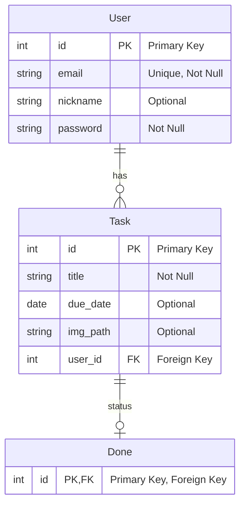

# 開発ツールについて
Package manager: **Poetry** (APIコンテナ内部も)

Linter: **flake8**

Formatter: **black**


# インフラ構成

フロントコンテナはディレクトリを監視し、自動にブラウザをリロードできる[browser-sync](https://browsersync.io/)を使用している



# アプリケーション構成
## api
### モジュール依存関係


### モジュール
- **FastAPIの入口**, `api/main.py`
  - FastAPIのインスタンスを作成し、ルーティングを読み込む
  - /staticに静的ファイルのホスティング
  - CORSのミドルウェア
- **ルーティング**, `api/routers/**`
  - ルーティングの定義
  - HTTPからデータを受け取り、CRUD操作に委譲
  - CRUD操作の結果を返す、適切なHTTPエラーを返す
- **API通信スキーマ**, `api/schemas/**`
  - ルーティングで受け取るデータの形を定義
  - ルーティングで返すデータのスキーマ
- **CRUD操作**, `api/crud/**`
  - クエリでDBデータを返す
  - ルーティングで受け取ったデータでDBを操作
    - 基本的に`schemas`を`models`に変換し、`db`に反映
- **DBモデル(テーブル構造)**, `api/models/**`
  - DBのテーブル構造を定義
- **DBインフラ**, `api/db.py`
  - DBの接続情報を定義
  - DBのセッションを管理
- **extra_modules**
  - **基本的に学生は気にしなくていい、使用するだけ**
  - **認証**, `api/extra_modules/auth/**`
    - ユーザー認証に関する処理
  - **画像操作**, `api/extra_modules/image/**`
    - 画像のアップロードを受け保存する

### DB構造


### DBのテーブル構造の変更について
[README.md](../README.md#DBのテーブル構造の変更について)を参照

### API構造
#### 認証、ユーザー関連
詳しくは http://localhost:8000/docs を参照

- `POST /token`
  - ユーザー認証
  - Request
    - `Content-Type: application/x-www-form-urlencoded`
  - Err Response
    - 401 (Unauthorized)

- `POST /user`
  - ユーザー登録
  - Err Response
    - 400 (Bad Request) Email already registered

- `GET /me`
  - ログインユーザー情報取得
  - Err Response
    - 401 (Unauthorized)

#### タスク関連
- `POST /task`
  - タスク新規
  - Err Response
    - 401 (Unauthorized), 422 (Unprocessable Entity)

- `GET /task／{task_id}`
  - タスク詳細取得
  - Err Response
    - 401 (Unauthorized), 403 (Forbidden), 404 (Not Found)

- `GET /tasks`
  - タスク一覧取得
  - Err Response
    - 401 (Unauthorized)

- `PUT /task/{task_id}`
  - タスク情報更新
  - Err Response
    - 401 (Unauthorized), 403 (Forbidden), 404 (Not Found)

- `PUT /task/{task_id}/image`
  - タスク画像更新
  - Err Response
    - 401 (Unauthorized), 403 (Forbidden), 404 (Not Found)

- `DELETE /task/{task_id}`
  - タスク削除
  - Err Response
    - 401 (Unauthorized), 403 (Forbidden), 404 (Not Found)

- `POST /task/{task_id}/done`
  - タスク完了
  - Err Response
    - 400 (Bad Request) Done already exists
    - 401 (Unauthorized), 403 (Forbidden), 404 (Not Found)

- `DELETE /task/{task_id}/done`
  - タスク未完了
  - Err Response
    - 401 (Unauthorized), 403 (Forbidden), 404 (Not Found)

#### taskの画像について
- Create時は、`Create task` -> `task_id` -> `Update task image`の流れで行う
- `PUT /task/{task_id}`
  - Image以外の情報を更新する
- `PUT /task/{task_id}/image`
  - Imageのみを更新する

## frontend
### ファイル構造について
```bash
❯ tree .
frontend/
├── css
│   └── general.css
├── index.html
├── js
│   ├── api.js
│   └── general.js
├── login.html
├── signup.html
├── task-create.html
├── task-detail.html
└── task-update.html

3 directories, 9 files
```
- `./frontend/*` を全てPORT `3000` でホスティング

- 基本的に**1 ページ、1 HTMLファイル**で構成
  - パラメータはクエリーパラメータで受け取る
    - e.g. `http://localhost:3000/task-detail.html?taskId=1`

- API呼ぶ出し操作は`api.js`に記述
  - `return fetch(...).then(...)...` の感じ
  - `async/await`は使わない

### 開発について
- takenはlocalStorageに保存
  - `localStorage.setItem('token', data.access_token)`
  - ログイン時に取得、ログアウト時に削除

- htmlファイルは
  - `header`
  - `body`
    - レイアウトのみ記述
  - `script`
    - 処理の流れの一例として ⬇️
    - checkLogin
    - クエリーパラメータの取得
    - `onCLick`などのイベント関数を用意
    - API呼び出し
    - .thenでDOM操作

# スクリプト
学生用のスクリプトについては[README.md](../README.md#よく使うコマンドについて)を参照

### `sh script/rebuild-api.sh`
APIコンテナを再ビルドするスクリプト

### `sh script/rebuild-frontend.sh`
フロントコンテナを再ビルドするスクリプト

### `docker compose exec api poetry run python script/sata/insert_mock.py`
開発用にモックデータをAPI経由でDBに挿入するスクリプト

# テストについて
(WIP)